# Tutorial: How to set up and model with Jetbrain's MPS

## Install MPS

Download MPS **version 2020.2** from [Jetbrain's website](https://www.jetbrains.com/mps/download/previous.html). To run
MPS extract the files and execute from a terminal the `mps.sh` file located in the `bin` folder.

## Download the domain specific languages

For this assignment you need to download several languages and their dependencies. From any directory (preferably one
with other AST projects) do:

```
mkdir languages && cd languages
git clone https://github.com/samuelpg/component-dsl.git
git clone https://github.com/rosym-project/ros-2-dsl.git
git clone https://github.com/rosym-project/qos-dsl.git
git clone https://github.com/rosym-project/dds-dsl.git
git clone https://github.com/rosym-project/dimensions-dsl.git
```

Change the branch of the component DSL from `2019.3` to `multiple_ports`. This is required to model m:n connections that
are common with publisher-subscriber communication, such as the one used in ROS.

```
cd component-dsl
git checkout multiple_ports
```

## Set up MPS

> When you first open the assignment in MPS you might get the following event (pop-up in the lower right of the IDE)
> 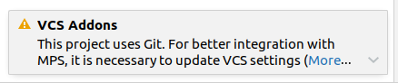
> 
> In this case, please open the message by clicking on the little "down arrow" and click "Update". Now another window
> like the one in the image below should open up. Simply click "OK".
> 
> 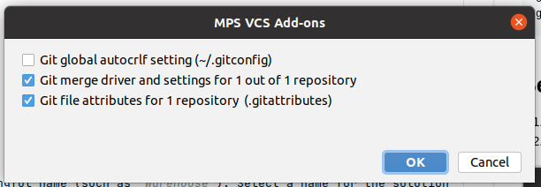

1. Install the `com.dslfoundry.plaintextgen` plugin from the JetBrains MPS marketplace. To do this, first go to
settings (`STR + Alt + S`) and then navigate to `Plugins`. You should now see the following window

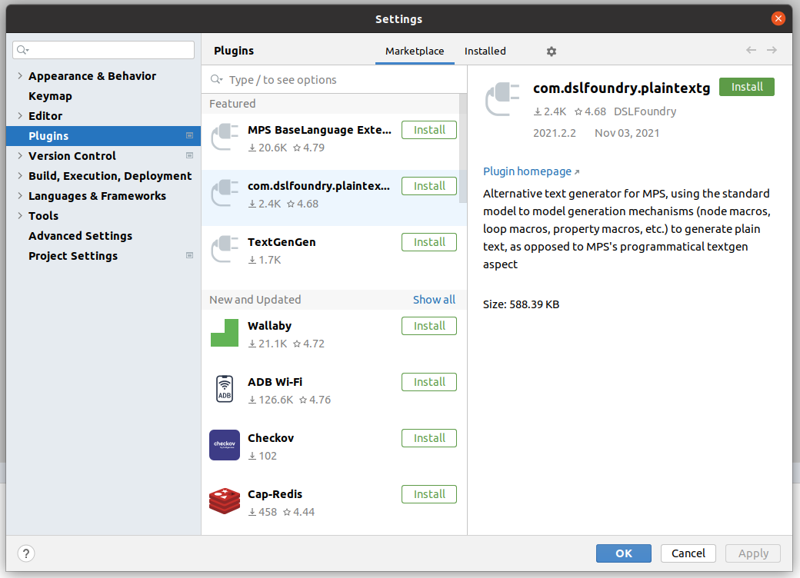

2. Navigate to `com.dslfoundry.plaintextgen` and click on the green "Install" button.

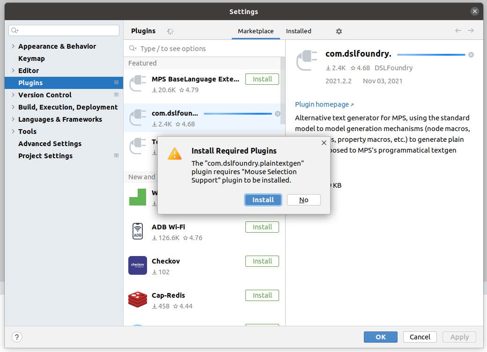
3. If a "Install Required Plugins" pop-up opens, don't worry, just click "Install" again.

## Setup Project

1. Create a new *solution* project and give it a meaningful name (such as `Warehouse`). Select a name for the solution
   as well.

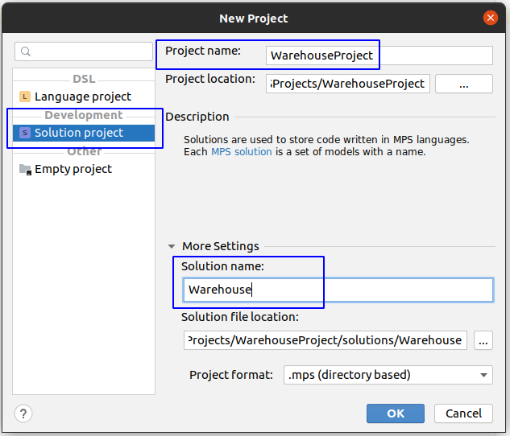

You should see in the logical view your project and solution

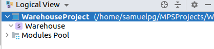

2. Right-click the project and select the **Project Modules** option at the end of the drop-down menu.
3. A window will open showing all modules, to add more, click the plus sign on the right side of the window.
4. Add all of the languages previously downloaded. To do so, navigate to the folder containing the language on the
   window that opens up and select the `.mpl` file that is in the `languages/<name of DSL>/` directory. **Note:**
   From `dimensions-dsl` we only need `Capabilities.mpl`, the other languages can be ignored.

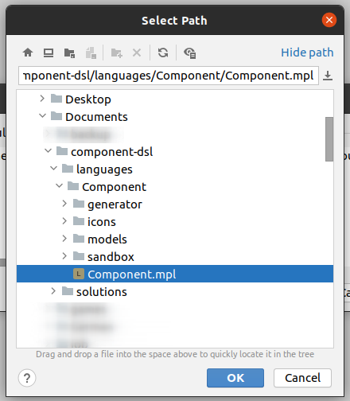

After adding all the modules, the logical view should look like this:

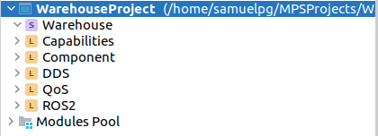

5. Right-click the solution (In this example `Warehouse`, which has a purple 's' before it on the logical view),
   select `new` and create a new `model`. Give it a name and click ok.
6. In the `Used Languages` tab, add all the languages by clicking the `+` button and selecting all the languages, as
   shown in the image below. Click ok on all tabs.

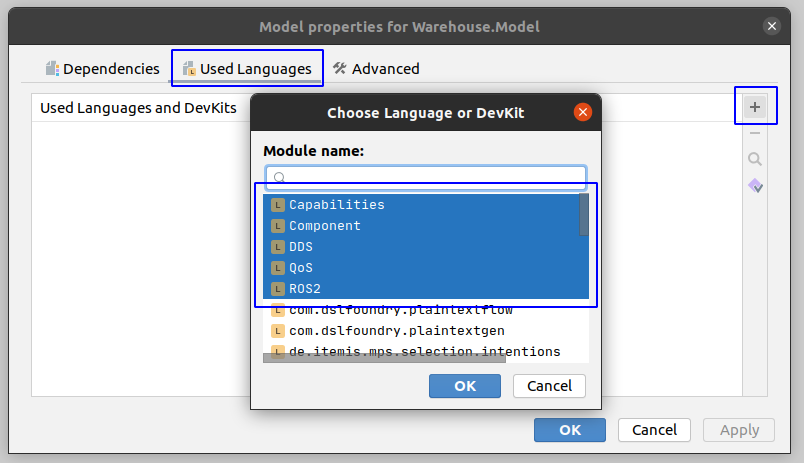

In the end, the hierarchy should look like this.

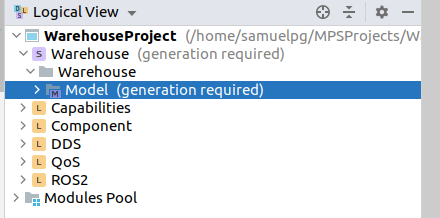

You can now right-click the `Model` solution and add models! Happy modeling!

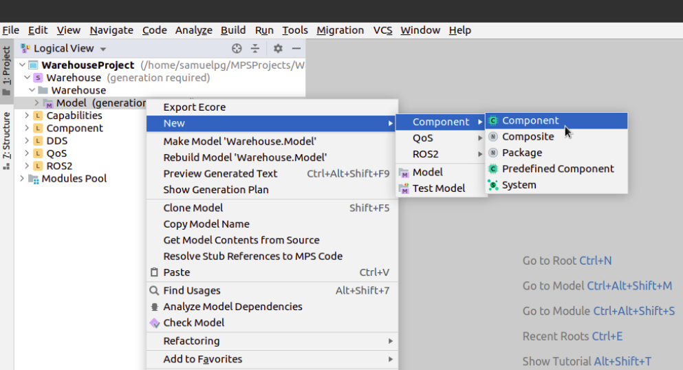

## How MPS works

To model in MPS, you need to understand how it works. MPS is a **projectional editor**. Models in MPS are represented
with an [Abstract Syntaxt Tree](https://en.wikipedia.org/wiki/Abstract_syntax_tree) or AST that is *projected* to look
like text. However, this AST is not edited like text. For more information on this, you can read this [article by
Jetbrains](https://www.jetbrains.com/mps/concepts/).

Modeling is done through key shortcuts. The most important one being `ctrl + space`, which will autocomplete a field or
show you all possible values, like so:

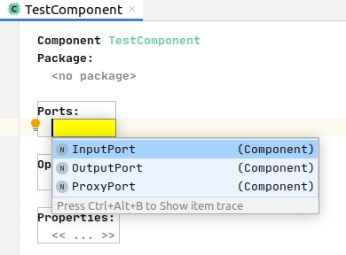
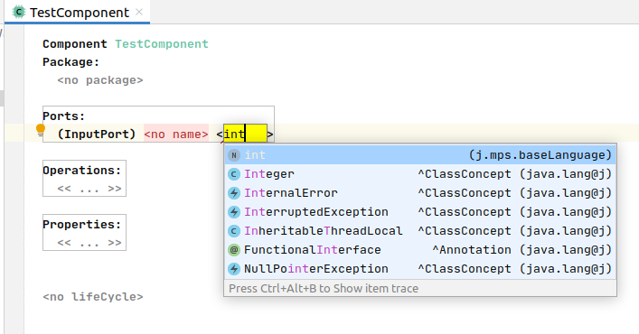

Some concepts, like the one required for adding QoS profiles to ports, are accessible only through annotations. To add
an annotation, select the component you would like to annotate and press `alt + enter`, a drop-down menu with all the
possible actions will show up, among them, the one required to add the annotation.

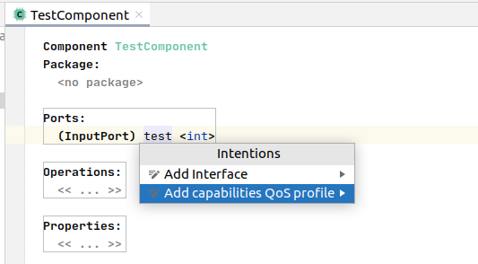

## Resources

* [MPS User's Guide](https://www.jetbrains.com/help/mps/mps-user-s-guide.html)